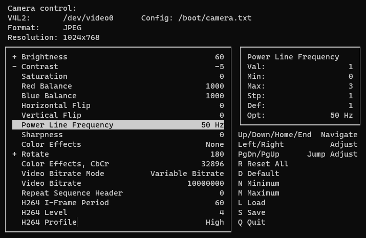

# camera-control



## Info
Simple command-line application for controlling camera settings.

Based on source code posted by AlexOD42 at [https://github.com/showmewebcam/showmewebcam/issues/56](https://github.com/showmewebcam/showmewebcam/issues/56)


## Dependencies
```sh
sudo apt-get install libncurses5-dev libncursesw5-dev 
```

## Compilation
```
make
```

## How to use
```
Usage: 
Available options are
 -a                    Load preset files in alphabetical order
 -c file               Path to config file
 -d                    Disable unsupported controls
 -f fps                Maximum FPS value (b/w 1 and 120, default: 30)
 -h                    Print this help screen and exit
 -i control_variable   Ignore control with defined variable name
 -l                    List available controls
 -p path               Path to directory with preset files
 -v device             V4L2 Video Capture device

# default config file - /boot/camera.txt
# default v4l2 device - /dev/video0
```

### Run
```
./camera-ctl

# List control variables
./camera-ctl -l

# Ignore selected controls by their variable name
./camera-ctl -i h264_i_frame_period -i h264_profile -i h264_level

```

### Using preset files
Loading of settings from presets files. Preset file name must start with number between 1 and 9.
Example:
/path/presets/1-day
/path/presets/2-night
/path/presets/3-fluorescent-lamp
etc.

Switching between presets is performed via the keyboard keys from 1 to 9 and <tab> key.

```
./camera-ctl -p /path/presets
```

### User interface
|keyboard key|action|
|:-----------|:-----|
|Up|Previous item|
|Down|Next item|
|Home|First item|
|End|Last item|
|Left|Decrease value by one step|
|Right|Increase value by one step|
|PgDn|Decrease value by ten steps|
|PgUp|Increase value by ten steps|
|R|Reset all items|
|D|Set default value for current item|
|N|Set minimum value for current item|
|M|Set maximum value for current item|
|L|Load settings from config file|
|S|Save settings to config file|
|Q|Quit application|
|U|Get actual values from a video device|
|1|Load preset file 1|
|2|Load preset file 2|
|3|Load preset file 3|
|4|Load preset file 4|
|5|Load preset file 5|
|6|Load preset file 6|
|7|Load preset file 7|
|8|Load preset file 8|
|9|Load preset file 9|
|Tab|Switch between preset files|
